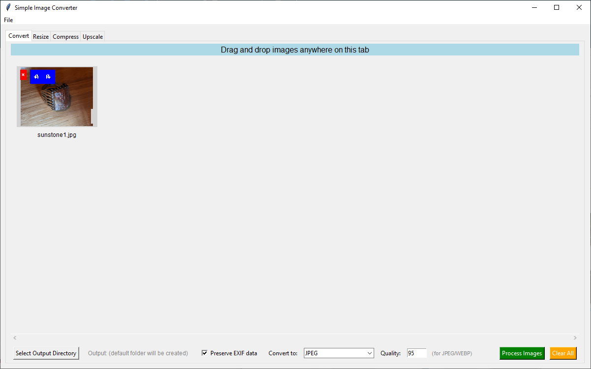

# Simple Image Converter 🖼️✨
<p>A simple and intuitive Python image conversion tool with a graphical user interface, designed to do simple manipulation of image files without having to upload them somewhere or open a full-fledged image editor.</p>
<br>
<p>I first made this for personal use because my friends kept sending me HEIC & RAW files and I couldn't open them. I didn't want to upload them to a random website to convert/resize them, and I didn't want to open krita or photoshop every time I got a file so now we're here. Image compression was also an issue for me for websites with file limits and there's no way to make webps easily.</p>
<br>

## Features
- 🔄 Converts all types of files including HEIC and RAW files to other formats (e.g., JPEG, PNG)

- ↕️ Resize & Compress images for websites and online usage

- 🤖 Upscale images with REALESRGAN

- 🖥️ User-friendly GUI for easy interaction (no command line needed!)

- 📂 Batch conversion support for handling multiple files at once

- ⚡ Lightweight and fast




## Installation
<p>Download the .pyw file or clone this repository</p>
<br>

```bash
git clone https://github.com/foooooooooooooooooooooooooootw/simple-image-converter.git
cd simple-image-converter
```
<br>
<p>(Optional) Create and activate a virtual environment</p>
<br>

```bash
python -m venv venv
source venv/bin/activate
```
<br>

## Install dependencies
There is no need for this since the program automatically installs dependencies on launch. Just run it!
